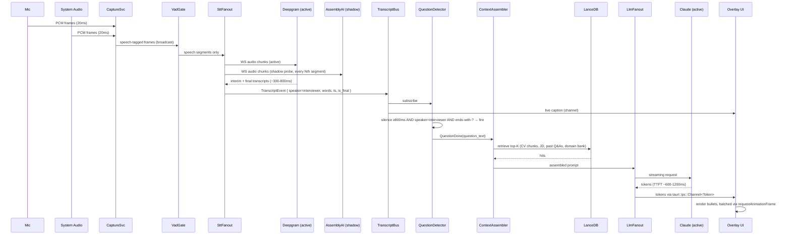

# Architecture Research

**Domain:** Live interview copilot — Mac desktop overlay (real-time STT + LLM streaming + RAG)
**Researched:** 2026-04-26
**Confidence:** HIGH on shape (multi-process Tauri / Rust core / web UI is dominant pattern in 2025); MEDIUM on specifics (failover orchestration patterns documented in only one comparable OSS project — Natively); LOW-and-flagged on stealth (macOS 15+ broke `NSWindow.sharingType=.none` against ScreenCaptureKit — see PITFALLS).

---

## TL;DR for the roadmap

- **Shape:** Three-layer Tauri app — Rust core (audio + STT + failover + RAG) ⇄ TypeScript/React webview (overlay UI) ⇄ optional native Swift sidecar (window-level + screen-capture detection that Rust can't easily do).
- **Hot path latency budget (5s total):** capture+VAD ~50ms · STT streaming ~300-800ms · question-end detect ~500-1500ms (silence threshold) · context assembly ~50ms · LLM TTFT ~600-1200ms · render bullets streaming. **Realistic floor: 2.5-3.5s.** Anything over 5s = product fails.
- **Build order critical path to "barely usable v1":** mic-only capture → Deepgram streaming → naive question-end (silence + hotkey) → static prompt to Claude → bullets render. **Then** add system audio loopback, diarization, JD/CV context, failover, stealth. Failover is *not* on the critical path to v1 — it's required for "shippable" but a single-vendor v1 proves the pipeline first.
- **Privacy boundary:** raw audio → Deepgram (zero-retention BAA) only. Transcribed text + CV/JD context → Claude (zero-retention). Everything else (transcripts, profile, JD snapshots, RAG vectors) stays local in `~/Library/Application Support/<app-id>/`. No backend.
- **Major architectural risk to flag now:** macOS 15+ broke the cheap stealth trick. `NSWindow.sharingType=.none` is ignored by ScreenCaptureKit, which is what Zoom/Teams/Meet use. Plan a research spike in the stealth phase before assuming it works.

---

## System Overview

```
┌──────────────────────────────────────────────────────────────────────────┐
│                         TAURI WEBVIEW (UI THREAD)                         │
│  ┌────────────────┐  ┌──────────────┐  ┌──────────────┐  ┌────────────┐  │
│  │ Overlay Bullets│  │ Live Caption │  │ Brief / Prep │  │ Debrief UI │  │
│  └───────┬────────┘  └──────┬───────┘  └──────┬───────┘  └─────┬──────┘  │
│          │ tokens via Channel<T>            │                  │         │
└──────────┼──────────────────┼─────────────────┼──────────────────┼────────┘
           │ events / cmds    │                  │                  │
═══════════╪══════════════════╪══════════════════╪══════════════════╪═══════
           │     IPC: tauri::ipc::Channel + commands + events       │
═══════════╪══════════════════╪══════════════════╪══════════════════╪═══════
           ▼                  ▼                  ▼                  ▼
┌──────────────────────────────────────────────────────────────────────────┐
│                          RUST CORE (TOKIO RUNTIME)                        │
│                                                                            │
│  ┌────────────────────────── HOT PATH (live mode) ────────────────────┐  │
│  │                                                                      │  │
│  │  CaptureSvc ──broadcast──► VadGate ──► SttFanout ──► Diarizer       │  │
│  │  (mic + sys)               (silero)    │   │   │      (provider     │  │
│  │       │                                │   │   │       OR custom)    │  │
│  │       └──ring buffer (10s)             │   │   │                     │  │
│  │                              Deepgram◄─┘   │   │                     │  │
│  │                              AssemblyAI◄───┘   │  ► Transcript bus   │  │
│  │                              WhisperLocal◄─────┘    (broadcast)      │  │
│  │                                                                      │  │
│  │  TranscriptBus ──► QuestionDetector ──► ContextAssembler ──► LlmFanout│  │
│  │       │              (silence+turn       (CV+JD+RAG+state)   │  │  │ │  │
│  │       │              + classifier)                  ▲        │  │  │ │  │
│  │       │                                             │        │  │  │ │  │
│  │       └──► RagIndexer ──► LanceDB ◄─────────────────┘        │  │  │ │  │
│  │           (background)                                        │  │  │ │  │
│  │                                                       Claude◄─┘  │  │ │  │
│  │                                                       GPT-4◄─────┘  │ │  │
│  │                                                       Llama-local◄──┘ │  │
│  └────────────────────────────────────────────────────────────────────┘  │
│                                                                            │
│  ┌────────────── COLD PATH (brief / debrief / RAG mgmt) ──────────────┐  │
│  │  CvParser  ·  JdParser  ·  WebResearch (Tavily)  ·  DebriefSvc      │  │
│  │  MemoryReindex (queue)  ·  EmbeddingSvc (local model or API)       │  │
│  └────────────────────────────────────────────────────────────────────┘  │
│                                                                            │
│  ┌────────────────────── PERSISTENCE (local only) ────────────────────┐  │
│  │  SQLite (sqlx)              LanceDB              Disk (audio cache)│  │
│  │  ── interviews              ── transcript        ── recent N min   │  │
│  │  ── transcripts (JSONL)     ── memory chunks     ── for replay/QA  │  │
│  │  ── profile (CV)            ── domain Q-banks    ── encrypted opt. │  │
│  │  ── jd snapshots            ── embeddings                          │  │
│  │  ── settings (api keys)                                            │  │
│  └────────────────────────────────────────────────────────────────────┘  │
└──────────────────────────────────────────────────────────────────────────┘
           ▲                                                       ▲
           │ FFI / sidecar (objc2 crate or Swift sidecar binary)   │
           ▼                                                       ▼
┌──────────────────────────────────────────────────────────────────────────┐
│                  NATIVE macOS SHIM (Swift binary or objc2)                │
│  ── Window-level / sharingType / setContentProtection                     │
│  ── ScreenCaptureKit-based screen-share detection (SCShareableContent)    │
│  ── Global hotkey registration (CGEventTap or HotKey crate)               │
│  ── Accessibility permissions checks                                      │
│  ── ScreenCaptureKit audio loopback (alt path to BlackHole)               │
└──────────────────────────────────────────────────────────────────────────┘
           ▲
           │ external boundaries (cloud)
           ▼
┌──────────────────────────────────────────────────────────────────────────┐
│ ZERO-RETENTION CLOUD: Deepgram · AssemblyAI · Anthropic · OpenAI · Tavily │
└──────────────────────────────────────────────────────────────────────────┘
```

---

## Component Responsibilities

| Component | Owns | Implementation | Lives in |
|---|---|---|---|
| **CaptureSvc** | Open mic + system loopback streams; resample to 16kHz mono PCM; push frames into a ring buffer | `cpal` (mic) + `screencapturekit` crate (system audio, macOS 13+) — *not* BlackHole if ScreenCaptureKit works | Rust core, dedicated thread |
| **RingBuffer** | Last 10-30s of audio, multi-consumer | `tokio::sync::broadcast` of 20-30ms frames, or `ringbuf` crate for lock-free | Rust core |
| **VadGate** | Speech vs silence; emits speech segments + silence intervals | `silero-vad-rs` (ONNX via `ort`) or `voice-stream` crate | Rust core, async task |
| **SttProvider trait** | Abstract: `start_session() -> impl Stream<Item=TranscriptEvent>` | One impl per vendor (Deepgram WS, AssemblyAI WS, Whisper.cpp local) | Rust core, one task per active provider |
| **SttFanout / Failover** | Owns the "active" provider; runs shadow probe on standbys; switches without losing transcript | Round-robin connection pool + exponential backoff on errors; shadow-probe pattern (Natively v2.5 reference) | Rust core, one supervisor task |
| **Diarizer** | Tag every word: `Gabriel` vs `Interviewer`. Two strategies: (a) trust provider (Deepgram diarization), (b) custom layer (energy + channel split — mic = Gabriel, system = interviewer is a near-perfect heuristic) | Strategy (b) is the *right default* — channel-of-origin tagging is more reliable than ML diarization for 2-speaker case, and works for fallback that lacks diarization (Whisper.cpp). Use provider diarization only as enrichment. | Rust core |
| **TranscriptBus** | Append-only stream of `TranscriptEvent { ts, speaker, words[], is_final }` | `tokio::sync::broadcast` + flush to SQLite (JSONL or row-per-utterance) | Rust core |
| **QuestionDetector** | Decide: "is the interviewer done with their question?" → fires `QuestionDone` event | Rules: speaker is interviewer + silence ≥ X ms (configurable, default 800ms) + last sentence ends in `?` or interrogative pattern. Plus hotkey override. ML classifier optional v2. | Rust core, subscribes to TranscriptBus |
| **ContextAssembler** | Build the LLM prompt: CV facts + JD + interview state + last N transcript turns + RAG hits + domain persona | Function call: takes question, returns assembled prompt under N tokens (e.g., 8k) | Rust core, called per question |
| **RAG / MemoryStore** | Query embeddings, return top-K chunks | LanceDB embedded (4MB idle, 150MB query — vs Qdrant 400MB constant). HNSW or IVF_PQ index. | Rust core, embedded |
| **RagIndexer** | Background: chunk new transcripts → embed → upsert to LanceDB | Queue-driven worker. Embeds via local model (e.g., BGE-small ONNX) or Voyage/OpenAI API. **Never on the hot path.** | Rust core, low-priority task |
| **LlmProvider trait** | `complete_streaming(prompt) -> impl Stream<Item=Token>` | Claude (Anthropic SDK), OpenAI, Ollama (local) | Rust core |
| **LlmFanout / Failover** | Same pattern as STT but on per-request basis (LLM is per-question, not persistent connection) | Try primary, on error/timeout (e.g. 1.5s no first token) → switch | Rust core |
| **OverlayUI** | Render bullets streaming, transcript caption, status, hotkey hints | React + TypeScript in Tauri webview. Always-on-top window, frameless, transparent | Webview |
| **NativeShim** | Window-level + sharingType + content protection + screen-share detection + global hotkey | Swift sidecar binary OR `objc2` Rust bindings. Sidecar is simpler and lets you use Apple SDKs directly | Native macOS |
| **HotkeyMgr** | Global shortcuts (toggle overlay, force-trigger generation, paranoid mode) | `tauri-plugin-global-shortcut` (works) or native shim if conflicts | Rust core via plugin |
| **ScreenShareDetector** | "Is some app currently capturing the screen?" → fire event → UI hides/blurs | `SCShareableContent` polling (1-2 Hz) or audit log heuristic. **Best-effort** — this is intrinsically racy. | Native shim |
| **PersistenceSvc** | SQLite ops: interviews, transcripts, profile, JDs, settings | `sqlx` + `tauri-plugin-sql` for migrations | Rust core |
| **CvParser / JdParser / WebResearch** | Cold-path: extract structured data from PDFs/text, do company research via Tavily | Cold path, not latency sensitive — can use full LLM passes | Rust core |
| **DebriefSvc** | Post-session: read transcript + bullets generated → produce critique | LLM batch call after session ends | Rust core |

---

## Data Flow: Audio → Bullets

### The hot path (mermaid)



### Latency budget (target: total ≤ 5s, ideal 2.5-3.5s)

| Stage | Target | Realistic floor | Notes |
|---|---|---|---|
| Mic frame → ring buffer | <5ms | <5ms | Trivial |
| VAD decision | <30ms | ~20ms | Silero ONNX on CPU is fine |
| STT first interim | 200-400ms | 200ms | Deepgram Nova-3 streaming |
| STT final | 200-400ms after speech ends | ~300ms | |
| Question-end detection | 500-1500ms | =silence threshold | This is the biggest knob — set 800ms default. **Hotkey skips this.** |
| Context assembly + RAG | 50-200ms | 80ms | Local embeddings + LanceDB query |
| LLM TTFT (Claude streaming) | 600-1200ms | ~800ms | Sonnet via Anthropic API |
| First token → UI rendered | <50ms | ~30ms | Tauri Channel, no JSON re-serialization |
| **TOTAL to first bullet visible** | **2-3.5s** | **~2.5s** | After interviewer stops speaking |
| Full bullets streamed | +1-2s | | Streams as Claude generates |

> **Implication for roadmap:** the 5s target is achievable but not loose. Diarization+question-detect+RAG+LLM all need to be fast individually. **Profile each stage by milestone exit.**

---

## State Management

### Per-session (volatile, in memory)
- Active STT session handle + provider
- Last N seconds of audio (ring buffer, ~10s)
- Live transcript buffer (current utterance, before final)
- Detected language (current)
- Current question candidate (being built)
- Streaming bullets (tokens arriving)
- UI state: overlay position, paranoid mode flag, screen-share status
- API keys decrypted in memory only

### Persistent (SQLite)
- `interviews` (id, jd_id, started_at, ended_at, status, transcript_path)
- `transcripts` (interview_id, JSONL file path with utterances) — **JSONL, not row-per-word**, for fast append + cheap reload
- `messages` (interview_id, role, ts, content, tokens_in, tokens_out, vendor, latency_ms) — for cost/perf telemetry
- `profile` (single row: cv_text, cv_structured_json, languages, prefs)
- `jd_snapshots` (id, raw_text, parsed_json, company, role, brief_md, created_at)
- `settings` (key, value) — incl. encrypted vendor API keys (Tauri stronghold or OS keychain via `keyring` crate)
- `domain_qa_banks` — could also live in LanceDB
- `feedback` (interview_id, callback?, comment, score, created_at)

### Persistent (LanceDB)
- `memory_chunks` (id, interview_id, text, embedding, metadata{ speaker, ts, is_question, is_response, language })
- `cv_chunks` (id, text, embedding, metadata)
- `jd_chunks` (id, jd_id, text, embedding, metadata)
- `domain_qbank` (id, domain, type{question|case|framework}, text, embedding)

### On-disk
- Recent audio cache (last N minutes for QA / replay) — **opt-in, encrypted, auto-purged**
- Logs (rotated) — never raw audio in logs

### Key state-management rules
1. **Audio never lives in SQLite.** Disk only, opt-in, auto-purged.
2. **Transcripts as JSONL files** referenced by SQLite — append is O(1), reload is one read.
3. **API keys in keychain**, never in SQLite plaintext.
4. **Volatile state is recoverable on crash** from SQLite + JSONL — except the current 10s ring buffer, which is acceptable to lose.

---

## Concurrency & Threading

### Rust core: Tokio multi-threaded runtime
- **Audio capture thread** (dedicated, real-time priority if possible) — NEVER blocks. Just pushes frames into broadcast.
- **VAD task** — async, single instance, fed by audio broadcast.
- **STT supervisor task** — owns the active provider. Spawns one sub-task per active connection (primary + shadow probes).
- **Per-provider STT tasks** — one async task per WS connection.
- **TranscriptBus subscribers** — multiple async tasks (UI publisher, QuestionDetector, RagIndexer enqueuer).
- **QuestionDetector** — single task, debounced.
- **LLM request task** — spawned per question, streams back via Channel.
- **RagIndexer worker** — low-priority; processes a queue. **Never blocks the hot path.**
- **PersistenceSvc** — single writer task per resource (avoid SQLite "database is locked" by serializing writes).

### Webview: single JS thread
- React renders. Tokens arrive via `Channel<Token>` — append to a `useRef`-backed buffer, batch via `requestAnimationFrame` to a state update. **Avoid `setState` per token** — that's the bullet flash.
- Overlay positioning + drag handled in JS; click-through toggling via `setIgnoreCursorEvents` exposed as a Tauri command.

### Hot path SLA rules
1. **No blocking I/O on the audio thread** — only lock-free push to ring buffer.
2. **No SQLite writes on the hot path** — buffer transcripts in-memory, batch-flush every 1-2s.
3. **No embedding calls on the hot path** — RAG queries use the *existing* index; new transcript chunks are indexed in background.
4. **One LLM request per question, never speculative** — cost too high for `~1-3$/hr` budget if every interim utterance triggers Claude.

---

## IPC Pattern: Rust ⇄ Webview

This is one of the load-bearing decisions. Get it wrong and either bullets render slowly or the IPC saturates.

### Rule 1 — Use `tauri::ipc::Channel<T>` for streaming, not events
- Tauri 2 events are JSON-serialized, broadcast to all listeners, no backpressure, no typed payloads. **Fine for "screen-share detected" or "session started" — bad for token streams.**
- `Channel<T>` is point-to-point, typed, supports raw payloads (Tauri 2 added this), has lower overhead. **Use Channel for: STT interim/final transcripts, LLM streaming tokens, audio level meters.**
- (Source: Tauri 2 IPC docs + Tauri 2.0 release notes — JSON serialization removed for raw payloads, big perf win.)

### Rule 2 — Use commands (`#[tauri::command]`) for request/response
- Start/stop session, update settings, run prep brief, save feedback. Anything that's "do this and tell me when done."

### Rule 3 — Use events for fan-out broadcast notifications
- Screen-share detected, paranoid mode toggled, vendor failed over. Things multiple windows might care about.

### Concrete IPC surface (sketch)

```rust
// Commands (frontend → Rust, request/response)
start_interview(jd_id: String) -> InterviewHandle
stop_interview(id: String) -> ()
set_paranoid_mode(on: bool) -> ()
save_jd(text: String, source: JdSource) -> JdSnapshot
trigger_generation_now() -> ()        // hotkey override
get_interview_history() -> Vec<Interview>
debrief(interview_id: String) -> DebriefReport

// Channels (Rust → frontend, streaming)
on_transcript: Channel<TranscriptEvent>
on_bullets: Channel<BulletToken>
on_audio_level: Channel<f32>          // VU meter, low-priority
on_question_detected: Channel<QuestionEvent>

// Events (Rust → frontend, broadcast notifications)
"vendor_failover" -> { from, to, reason }
"screen_share_state" -> { active: bool, app: Option<String> }
"language_detected" -> { lang: "fr" | "en" }
"degraded_mode" -> { reason: "all_cloud_down" | "rate_limit" }
```

### Streaming token render — the no-flash recipe
1. Tokens arrive via `Channel<BulletToken>`.
2. Append to a ref-backed buffer: `bufferRef.current += token.text`.
3. Schedule one rAF: `requestAnimationFrame(() => setText(bufferRef.current))`.
4. Use a stable container (no layout-thrashing parents).
5. Bullets are rendered as ordered `<li>` keyed by index — only the *last* `<li>` re-renders during streaming.
6. `React.memo` on each non-final bullet.

---

## Failover Orchestration

### STT failover (persistent WebSocket — hot standby pattern)

This is the hardest part. Naïve: "primary fails → reconnect to backup" loses 2-5s and drops the live transcript. Correct pattern (drawn from Natively's v2.5 design — the only OSS reference in this space):

1. **Connection pool per vendor**, not single connection. Round-robin within vendor for resilience to a single bad WS instance.
2. **Active + shadow probe.** Primary (Deepgram) gets the audio stream. Standby (AssemblyAI) gets a **periodic short audio probe** (e.g., 5s every 60s) to verify it's healthy and the auth still works.
3. **Health signals (per provider, sliding window):**
   - WS connection: connected? last keepalive < 5s ago?
   - Latency: p95 of (audio sent → transcript received) < 1.5s?
   - Error rate: 5xx or auth fails in last 60s?
4. **Switch threshold:**
   - **Soft switch** (preferred): primary degraded 3 cycles → switch within 1s using the warmed standby connection. Continue feeding both for 2-3s to bridge the gap, dedupe on output.
   - **Hard switch:** primary connection dead AND reconnect failed twice → switch immediately. Lose at most ~1-2s of audio (replay from ring buffer to the new provider).
5. **Replay buffer:** keep last 10-15s of speech-only audio in memory. On switch, replay it to the new provider so the transcript catches up.
6. **No dual-run on hot path** in steady state. Dual-run is too expensive (`2x STT cost`). Shadow probe is enough to know "if I had to switch, would it work?"
7. **All cloud down → degraded mode** (Whisper.cpp local). UI shows a "DEGRADED" badge. Quality drops, latency rises (5-10s on M-series), but the app still functions.

### LLM failover (per-request — easier)
- Try primary (Claude). If first token doesn't arrive in `T_first_token` (e.g., 1.8s) OR HTTP error → cancel + retry with secondary (GPT-4) with the same prompt.
- Streaming retry is fine because no audio is in flight.
- All cloud down → Ollama local Llama with much smaller context. Show "DEGRADED" badge.

### Failover SLOs
- STT switch invisible to user: **target zero gap, max 1.5s gap acceptable.**
- LLM switch with first-token-timeout: **adds ≤2s to total latency** (still under 5s budget if primary was the slow one).
- Degraded-mode entry: **announce within 3s** of full-cloud failure.

### Health-check cadence
- WS keepalive: every 5s (Deepgram standard).
- Shadow probe: every 60s, ~3-5s of audio.
- Provider rotation policy: on N=3 consecutive failures within W=60s, mark unhealthy for 5min, then re-probe.

---

## Privacy Boundary

This is non-negotiable per `PROJECT.md` constraints. Make it an architectural invariant, not a runtime check.

### What crosses local → cloud

| Data | Crosses? | To whom | Retention |
|---|---|---|---|
| Raw audio (PCM) | YES | Deepgram (or AssemblyAI fallback) | **Zero (BAA / contractual)** |
| Transcripts (text) | NO by default; YES to LLM as part of prompt | Claude / GPT (zero-retention) | Zero (Anthropic / OpenAI ZDR contracted) |
| CV text + JD text | YES (in LLM prompt + brief research) | Claude + Tavily/Exa | Zero |
| Bullets generated | NO (stays local) | — | — |
| Memory chunks (past transcripts) | NO (only top-K text included in LLM prompt; embeddings local) | — | — |
| Voice biometrics / speaker embeddings | NO | — | — |
| Audio cache on disk | NEVER leaves the machine | — | Local only, opt-in, auto-purged |

### Architectural enforcement
1. **Single egress module** (`CloudClient` trait) — every outbound HTTP/WS goes through it. Logs every request type. **Audit-able.**
2. **Vendor config explicitly declares retention policy** — at startup, fail loudly if a configured vendor doesn't have ZDR contracted.
3. **No telemetry by default.** No Sentry, no PostHog, no analytics. (Personal app — no need to phone home.)
4. **API keys in macOS Keychain** (`keyring` crate or Tauri Stronghold) — never in SQLite or settings.json.
5. **Encrypted at rest** for transcripts/audio cache via macOS FileVault (system) + optional app-level encryption for sensitive snapshots (`age` crate).

### Privacy invariant tests (recommend in QA phase)
- Wireshark / proxy test: with all features active, no traffic to any host outside the declared whitelist.
- Disk-image test: with audio cache disabled, no audio files written outside `/tmp` ephemeral.

---

## Diarization Strategy

The core question: do we trust the STT vendor's diarization, or roll our own?

**Recommendation: Channel-of-origin first, vendor diarization as enrichment.**

### Why channel-of-origin wins for this app
- We have **two distinct audio sources**: mic (Gabriel) + system loopback (interviewer). Each captured separately, then merged for STT.
- The "who spoke" question is trivially answered by "which channel was active when this audio was emitted." 99%+ accuracy with no ML.
- Works even when STT lacks diarization (Whisper.cpp local fallback has no diarization — without channel-tagging, fallback mode would lose speaker info).
- Avoids edge cases where Deepgram diarization confuses voices on a single mixed channel (which is what happens if you submit mic+system mixed).

### Implementation
- Run **two parallel STT sessions** — one on mic, one on system loopback.
- Each emits transcripts already tagged by channel (= speaker).
- Merge into a single TranscriptBus, ordered by timestamp, with `speaker` field set from channel.
- Cost: 2x STT cost. Acceptable given Gabriel's `~1-3$/hr` budget — and Deepgram pricing is per-minute not per-channel-equivalent in many tiers.

### When vendor diarization helps (enrichment, not source of truth)
- Multi-person panel interviews (3+ people on the system channel).
- For these, *also* enable Deepgram diarization on the system channel and split the "interviewer" speaker into `interviewer_1`, `interviewer_2`.

### Trade-off
- 2 STT connections = 2x failover complexity. The supervisor task manages two pools.
- 2 STT connections = harder to keep in time-sync. Use absolute timestamps everywhere, never relative-to-stream.

---

## Memory / RAG: when to (re)index

**Rule: never on the hot path.**

### Indexing triggers
1. **CV uploaded / changed** → chunk + embed + upsert (blocking, but cold path; user is fine waiting 10-30s).
2. **JD pasted** → same.
3. **New transcript utterance finalized** → enqueue for background indexing. Worker batches every 30s.
4. **Interview ended** → final pass: chunk full transcript at semantic boundaries (Q&A pairs), re-index with richer metadata (which question, what bullets were shown, what Gabriel actually said, was the answer "good"). This is the post-session pipeline.

### Why batch and not per-utterance
- Embedding calls have fixed latency (~50-200ms each) — batching is essential.
- Live transcripts have lots of false starts, "uh", "let me rephrase" — wait until utterance is final + has a few seconds of context.
- During an interview, the *current session's* memory isn't useful — the LLM already has the live transcript verbatim. Cross-session memory matters for the *next* interview.

### Embedding model choice
- **Local: BGE-small / GTE-small** (ONNX via `ort` crate, ~30MB model, ~5ms per chunk on M-series). Privacy ✓, latency ✓, no per-call cost.
- **API: Voyage / OpenAI text-embedding-3-small.** Better quality, but adds privacy boundary crossing for memory (which we explicitly don't want).
- **Recommendation: local BGE for the personal memory store. API embeddings only if quality is bad.**

### LanceDB schema (per table)
- `id` UUID, `text` TEXT, `embedding` VECTOR(384 or 768), `metadata` JSON
- IVF_PQ index for `memory_chunks` if it grows large; HNSW if memory is fine. (Lance picks based on size.)

---

## Language Detection & Switching

**Recommendation: sentence-level detection, but session-tracked.**

### Decision tree
1. **Session start:** ask user (UI dropdown) FR / EN / "auto." Default = auto.
2. **Auto mode:** first 10s of speech → run language ID. Set session language. Configure STT for that language.
3. **Mid-session switch detection:**
   - AssemblyAI Universal-3 Pro: native code-switching support — let the model handle it (just configure multi-lang).
   - Deepgram: supports `detect_language=true` for some models, but quality varies. Safer to detect outside.
   - Custom: every N final utterances, run a tiny language ID model (`whisper-tiny` or `lingua-rs`) on the latest 10s. If 3 consecutive utterances are different from session lang → switch.
4. **On switch:** STT supervisor stops the current Deepgram session and starts a new one with the new language. **Replay last 5s from ring buffer** to bridge the gap.
5. **Cooldown:** don't switch back faster than every 10s — avoids ping-pong on bilingual speakers.

### Component ownership
The **STT supervisor** owns the language decision (it's the only place that knows the audio + the active provider). Other components are notified via an `on_language_changed` event.

### Edge case: Gabriel speaks FR, interviewer speaks EN
With channel-tagged STT, we run **independent language detection per channel**. Mic (Gabriel) might be FR, system (interviewer) might be EN. The LLM gets both languages in the transcript and is instructed to **respond in the interviewer's language** (per `LIVE-02`).

---

## Stealth: Window Exclusion + Screen-Share Detection

**This is a major architectural risk. Flag it for early validation in the roadmap.**

### macOS 15+ broke the easy path
- `NSWindow.sharingType = .none` is **ignored by ScreenCaptureKit** since macOS 15.
- Zoom, Teams, Meet, OBS — all use ScreenCaptureKit on modern macOS.
- This is documented in [tauri/issues/14200](https://github.com/tauri-apps/tauri/issues/14200), Apple Developer Forums, and confirmed by an Apple engineer: "virtually all screen recording apps operate below the window level, which means kCGWindowSharingState has no effect."
- (See PITFALLS.md — this likely deserves a dedicated phase research spike.)

### Defense-in-depth strategy (because no single technique works)
1. **Layer A — Cheap window-level tricks** (still useful for legacy capture APIs and some apps):
   - `NSWindow.sharingType = .none`
   - `setContentProtection` (macOS 14.4+)
   - Special window level (`.statusBar` or higher)
   - These work against `CGWindowListCreateImage` / older paths.
2. **Layer B — Screen-share detection + auto-blur** (this is the *real* defense):
   - Use `SCShareableContent` polling (1 Hz) to detect "is some app currently capturing the display?"
   - When detected → instantly blur or hide the overlay (paranoid mode).
   - Configurable: per-app whitelist (e.g., always hide if Zoom/Teams/Meet is recording).
   - Latency target: < 200ms from share start to overlay hidden. Race condition exists; document it.
3. **Layer C — Manual paranoid hotkey** as last resort. Hit a hotkey → overlay invisible. Use this when in doubt.
4. **Layer D — Display routing trick** (researched but not free): some tools route the overlay to a virtual second display that the screen-share doesn't capture. More complex; v2 candidate.

### What this means for the roadmap
- **Validate Layer B in a research spike before committing to "stealth" as a v1 feature.**
- Layer A is a 1-day add. Layer B is the engineering. Layer C is a hotkey.
- If Layer B can't get below 500ms reliably, default to Layer C (hotkey) and document Layer B as best-effort.

---

## Recommended Project Structure

```
interview-copilot/
├── src-tauri/                      # Rust core
│   ├── src/
│   │   ├── main.rs                 # Tauri setup, command registration
│   │   ├── ipc/                    # Command/event/channel definitions
│   │   │   ├── commands.rs
│   │   │   ├── events.rs
│   │   │   └── channels.rs
│   │   ├── audio/                  # Capture + VAD + ring buffer
│   │   │   ├── capture.rs
│   │   │   ├── vad.rs
│   │   │   └── ringbuf.rs
│   │   ├── stt/                    # STT abstraction + providers
│   │   │   ├── mod.rs              # SttProvider trait
│   │   │   ├── supervisor.rs       # Failover + shadow probe
│   │   │   ├── deepgram.rs
│   │   │   ├── assemblyai.rs
│   │   │   └── whisper_local.rs
│   │   ├── transcript/             # Bus + diarization + question detect
│   │   │   ├── bus.rs
│   │   │   ├── diarize.rs          # Channel-of-origin tagging
│   │   │   └── question_detect.rs
│   │   ├── llm/                    # LLM abstraction + providers
│   │   │   ├── mod.rs
│   │   │   ├── supervisor.rs
│   │   │   ├── claude.rs
│   │   │   ├── openai.rs
│   │   │   └── ollama.rs
│   │   ├── context/                # Prompt assembly
│   │   │   └── assembler.rs
│   │   ├── rag/                    # RAG / memory
│   │   │   ├── lance.rs
│   │   │   ├── embed.rs
│   │   │   └── indexer.rs          # Background worker
│   │   ├── persist/                # SQLite layer
│   │   │   ├── schema.rs
│   │   │   ├── migrations/
│   │   │   ├── interviews.rs
│   │   │   ├── transcripts.rs
│   │   │   └── profile.rs
│   │   ├── prep/                   # Cold-path: brief, debrief, research
│   │   │   ├── cv_parse.rs
│   │   │   ├── jd_parse.rs
│   │   │   ├── web_research.rs
│   │   │   └── debrief.rs
│   │   ├── stealth/                # Window + screen-share (FFI to native shim)
│   │   │   ├── shim.rs             # FFI bindings
│   │   │   └── detector.rs
│   │   ├── cloud/                  # Single egress module (privacy boundary)
│   │   │   └── client.rs
│   │   └── lib.rs
│   ├── native-shim/                # Swift sidecar (compiled binary)
│   │   ├── Package.swift
│   │   └── Sources/NativeShim/
│   │       ├── main.swift
│   │       ├── WindowControl.swift
│   │       └── ScreenShareDetector.swift
│   ├── migrations/                 # SQL files
│   └── Cargo.toml
├── src/                            # Web frontend (React + TS)
│   ├── components/
│   │   ├── overlay/                # The hot UI
│   │   │   ├── Bullets.tsx
│   │   │   ├── LiveCaption.tsx
│   │   │   └── StatusBar.tsx
│   │   ├── prep/                   # Brief / JD / CV
│   │   ├── debrief/                # Post-session
│   │   └── settings/
│   ├── hooks/
│   │   ├── useTokenStream.ts       # rAF-batched token rendering
│   │   ├── useTranscript.ts
│   │   └── useChannel.ts           # Tauri Channel<T> helper
│   ├── lib/
│   │   └── ipc.ts                  # Typed wrappers around invoke()
│   └── App.tsx
├── docs/
└── .planning/
```

### Structure rationale
- **`src-tauri/src/<domain>/`** organized by domain, not by layer — each folder is self-contained (data, logic, IPC surface).
- **`stt/` and `llm/`** parallel structure (trait + supervisor + per-provider) makes adding a vendor a localized change.
- **`cloud/client.rs`** as single egress point — the privacy invariant is enforceable by code review.
- **`native-shim/`** as a compiled Swift binary sidecar is *significantly* easier than `objc2` Rust bindings for the Apple SDKs we need (ScreenCaptureKit, AppKit windowing). Tauri 2 supports native Swift sidecars per [Tauri discussion #9581](https://github.com/orgs/tauri-apps/discussions/9581).

---

## Build Order: Critical Path to v1

### Stage 0: Skeleton (1-2 days)
- Tauri 2 + React/TS scaffold
- SQLite plugin + first migration
- Logging + dev DX (hot reload, devtools)
**Exits when:** app boots, can read/write a row to SQLite from a Tauri command.

### Stage 1: "Hello transcript" (the spine) — CRITICAL PATH
1. **Mic-only capture** via `cpal` → ring buffer
2. **Deepgram WS** session, send audio, receive interim+final
3. **TranscriptBus** + emit to UI via `Channel<TranscriptEvent>`
4. **Live caption UI** in overlay (read-only, just shows transcript)

**Exits when:** speak into mic, see live transcript appear in <1s. **This is the spine.** Everything else hangs off it.

### Stage 2: "Hello bullets" — CRITICAL PATH
1. **Naive question-end:** silence threshold OR hotkey only (skip the speaker-shift logic for now)
2. **Static prompt:** hardcoded "answer this interview question with 3 bullets" + the last utterance
3. **Claude streaming** via Anthropic SDK
4. **Bullet rendering** in UI with rAF batching

**Exits when:** speak a question, hit hotkey, bullets stream in <5s. **This is "barely usable v1."** Gabriel could test it in a mock interview.

### Stage 3: System audio + diarization
1. **System loopback via ScreenCaptureKit** (or BlackHole fallback)
2. **Two parallel STT sessions** (mic + system)
3. **Channel-tagged TranscriptBus**
4. **Question detector v2:** silence + speaker-shift (only trigger when interviewer asked)

**Exits when:** real Zoom call, only generates bullets when interviewer speaks, not Gabriel.

### Stage 4: Real context (CV + JD)
1. **CV upload + parse** (LLM-based extraction, cold path)
2. **JD paste + parse**
3. **ContextAssembler v1:** static slots — CV summary + JD + last N transcript turns
4. **Snapshot per interview** (jd_id linked)

**Exits when:** bullets reference Gabriel's actual experience and the JD's actual asks.

### Stage 5: Stealth (RESEARCH SPIKE FIRST — see PITFALLS)
1. **Native Swift sidecar scaffold**
2. **Layer A:** sharingType + setContentProtection (cheap, works on legacy)
3. **Layer B:** SCShareableContent polling → emit `screen_share_state` event → UI auto-hides
4. **Layer C:** paranoid-mode hotkey

**Exits when:** Gabriel can demo with a friend on Zoom and the friend can't see the overlay.

### Stage 6: Failover (the "shippable" gate)
1. **AssemblyAI provider impl + supervisor with shadow probe**
2. **STT failover with replay buffer**
3. **GPT-4 provider impl + LLM failover with first-token timeout**
4. **Whisper.cpp + Ollama local degraded mode**

**Exits when:** kill Deepgram's API key mid-session → app continues without dropping >2s of transcript.

### Stage 7: RAG / memory (the "smart" gate)
1. **Local embedding model integration (BGE-small ONNX)**
2. **LanceDB integration + schemas**
3. **Background indexer + post-session indexing**
4. **ContextAssembler v2:** RAG hits from memory + domain banks

**Exits when:** bullets in interview N+1 visibly reference patterns from interview N.

### Stage 8: Brief + debrief (cold path completeness)
1. **Web research via Tavily/Exa for prep brief**
2. **Pitch generation per JD**
3. **Auto-debrief post-session**
4. **Pattern extraction across past sessions**

### Stage 9: Polish + edge cases
1. **Language detection + mid-session switching**
2. **Domain personae + framework templates**
3. **Multi-person diarization on system channel**
4. **UX: drag, position memory, hotkey customization**
5. **Cost telemetry + monthly summary**

### Dependency map (what blocks what)
```
0 Skeleton
   └─► 1 Hello transcript ──┬──► 2 Hello bullets ──┬──► 3 System audio + diarize
                            │                       └──► 4 CV/JD context
                            │                              └──► 7 RAG memory
                            └──► 5 Stealth (parallel)
                            └──► 6 Failover (parallel after 2)
                                  └──► 8 Brief/debrief (parallel after 4)
                                  └──► 9 Polish
```

**What can be parallel:**
- Stage 5 (stealth) is independent of stages 1-4 — different developer or different week.
- Stage 6 (failover) needs stage 1 (transcript spine) but is independent of 3-4.
- Stage 7 RAG can start once stage 4 is done.
- Stage 8 cold-path features can run in parallel with 6/7.

**What's the shortest path to "Gabriel uses it in a real interview"?**
0 → 1 → 2 → 3 → 4 → 5 → 6. Skip 7-9 for the first real test. Estimated 4-6 weeks of focused work.

---

## Patterns to Follow

### Pattern 1: Trait-based provider abstraction
**What:** Every external dependency (STT, LLM, embedding, web research) hides behind a trait. Concrete impls per vendor.
**When:** Always — the failover requirement makes this non-optional.
**Example:**
```rust
#[async_trait]
trait SttProvider: Send + Sync {
    async fn start_session(&self, cfg: SttConfig) -> Result<Box<dyn SttSession>>;
    fn name(&self) -> &str;
}

#[async_trait]
trait SttSession: Send {
    async fn send_audio(&mut self, frames: &[i16]) -> Result<()>;
    fn events(&mut self) -> Pin<Box<dyn Stream<Item = TranscriptEvent>>>;
    async fn close(self: Box<Self>) -> Result<()>;
}
```

### Pattern 2: Single egress for privacy
**What:** All cloud calls go through `cloud::Client`. Logged, audited, vendor-keyed.
**When:** Always. This is how the privacy invariant is enforced architecturally.

### Pattern 3: Channel-of-origin diarization before ML
**What:** Two STT sessions, one per audio channel. Speaker = channel.
**When:** When you control the audio sources (you do).

### Pattern 4: Hot/cold path separation
**What:** Anything in the 5s budget = hot path = aggressive perf. Anything outside (CV parse, debrief, brief, indexing) = cold path = quality over speed.
**When:** Always. Conflating the two is how the app gets slow.

### Pattern 5: rAF-batched streaming UI
**What:** Tokens arrive on a Channel, append to a ref, schedule one rAF per frame to flush to React state.
**When:** Anywhere LLM tokens or transcript words stream into the UI.

### Pattern 6: Sidecar for Apple-specific platform code
**What:** Compile a small Swift binary that does Apple-SDK things (ScreenCaptureKit window controls, etc.). Communicate via stdin/stdout JSON or a local socket.
**When:** When `objc2` bindings get painful (which they do for AppKit and ScreenCaptureKit).

---

## Anti-Patterns to Avoid

### Anti-pattern 1: Single-WebSocket STT
**What people do:** One Deepgram WS connection, reconnect on error.
**Why wrong:** A 2-3s reconnect during a live interview is catastrophic. No shadow probe = you don't know if your fallback is healthy until you need it.
**Do this instead:** Pool of connections per vendor + active/shadow with replay buffer.

### Anti-pattern 2: SQLite on the hot path
**What people do:** `INSERT INTO transcripts ...` per finalized utterance.
**Why wrong:** SQLite write contention can spike to 50-200ms. On the hot path, that's 5-10% of your latency budget for nothing.
**Do this instead:** Buffer in memory, flush every 1-2s in a background task. Use JSONL files for the actual transcript content with SQLite holding only the index/metadata.

### Anti-pattern 3: Per-token React `setState`
**What people do:** `setBullets(prev => prev + token)` on every Channel message.
**Why wrong:** 30-50 re-renders per second cause bullet flash, layout reflow, and a 200ms hit when bullets get long.
**Do this instead:** rAF-batched ref + single state update per frame.

### Anti-pattern 4: ML diarization on mixed audio
**What people do:** Mix mic+system into one stream, send to Deepgram with `diarize=true`, hope it figures out who's who.
**Why wrong:** Diarization on mixed cross-talk is unreliable. Voices on the system side (compressed Zoom audio) sound similar to the model.
**Do this instead:** Channel-of-origin tagging. Two separate STT sessions.

### Anti-pattern 5: Indexing transcripts on every utterance
**What people do:** Embed each finalized utterance immediately and upsert to LanceDB.
**Why wrong:** Embedding latency adds up; LanceDB writes contend with reads; the utterance might be revised. And the *current session's* memory isn't useful to itself.
**Do this instead:** Queue + batch. Re-index from scratch at session end with full context.

### Anti-pattern 6: Trusting `NSWindow.sharingType = .none` alone
**What people do:** Set the flag, ship, declare stealth done.
**Why wrong:** macOS 15+ ignores it for ScreenCaptureKit. Zoom uses ScreenCaptureKit. You're exposed.
**Do this instead:** Defense in depth — flag (Layer A) + active screen-share detection + auto-hide (Layer B) + manual hotkey (Layer C).

### Anti-pattern 7: Tauri events for high-frequency streams
**What people do:** `app.emit("transcript_word", word)` for every word.
**Why wrong:** JSON serialization per event, no backpressure, fanout to all listeners. CPU climbs, bullet UI gets jittery.
**Do this instead:** `Channel<T>` for streams. Events for low-frequency notifications only.

### Anti-pattern 8: Generating on every interim transcript
**What people do:** Trigger Claude on every interim (not final) transcript update.
**Why wrong:** 10-30x cost blowup. The last interim isn't even the question yet.
**Do this instead:** Only trigger on `QuestionDone` events. Hotkey override for impatient cases.

---

## Scaling Considerations

This is a personal app — there is no "1M users" scale. The relevant axes are:

| Scale | Adjustments |
|---|---|
| 1 user, 10 interviews | Default everything. SQLite + LanceDB are over-spec'd. |
| 1 user, 100 interviews | Memory store grows to ~1-5GB embeddings. Consider IVF_PQ on `memory_chunks`. Add UI to prune. |
| 1 user, 1000 interviews | Chunk by year-quarter; hot index is recent + relevant domain. Cold archive on disk. |
| Pivot to multi-user (out of scope) | Full rearchitecture: backend service, auth, vector store as service. Don't optimize for this now. |

### What breaks first if abused
1. **SQLite write contention** if transcripts are written per-word. → Already mitigated by batching.
2. **LanceDB query latency** at >100K vectors with HNSW in default config. → Switch to IVF_PQ or trim.
3. **API key cost** if Gabriel does 4-hour case-study marathons. → Cost telemetry + monthly summary in stage 9.

---

## Integration Points

### External services

| Service | Pattern | Notes |
|---|---|---|
| Deepgram | WebSocket persistent | Configure `keep_alive=true` and ping every 5s. Zero-retention contract required. Nova-3 model. |
| AssemblyAI | WebSocket persistent | Universal-3 Pro for native FR-EN code-switching. Backup STT. |
| Whisper.cpp | Local subprocess or `whisper-rs` crate | CPU/Metal backend. Use `tiny` or `base` for live, `large-v3` only for batch debrief. |
| Anthropic Claude | HTTPS streaming SSE | Anthropic SDK. **Beware:** SDK lacks idle-timeout — wrap with own 30s no-event abort (per Anthropic SDK GH issue #867). |
| OpenAI GPT-4 | HTTPS streaming SSE | OpenAI SDK. Backup LLM. |
| Ollama (local) | HTTP localhost:11434 | Llama 3.x quantized. Degraded mode only. |
| Tavily / Exa | HTTPS request/response | Cold path only (brief generation). Cache results in JD snapshot. |
| BGE-small (local) | ONNX via `ort` | ~30MB model, runs on CPU/Metal. Embeddings stay local. |

### Internal boundaries

| Boundary | Communication | Notes |
|---|---|---|
| Audio capture ↔ VAD | Lock-free ring buffer | No async, no allocation in hot loop |
| VAD ↔ STT | `tokio::broadcast` of audio frames | Backpressure: skip frames if STT slow (better than blocking VAD) |
| STT ↔ TranscriptBus | mpsc channel from each STT session into the bus | Bus then broadcasts to subscribers |
| TranscriptBus ↔ UI | Tauri `Channel<TranscriptEvent>` | Typed, low-overhead |
| QuestionDetector ↔ ContextAssembler | direct fn call (same task or cheap mpsc) | |
| LLM ↔ UI | Tauri `Channel<BulletToken>` | rAF-batched on JS side |
| RagIndexer ↔ LanceDB | direct calls in worker task | Non-blocking on hot path |
| Rust ↔ Native shim | Sidecar process w/ stdin/stdout JSON, OR `objc2` FFI | Sidecar simpler |

---

## Sources

- [Tauri 2.0 IPC docs (commands vs events vs channels, raw payloads)](https://v2.tauri.app/concept/inter-process-communication/)
- [Tauri 2.0 Stable Release Notes — IPC perf rewrite](https://v2.tauri.app/blog/tauri-20/)
- [Tauri 2 Calling the Frontend from Rust (Channels)](https://v2.tauri.app/develop/calling-frontend/)
- [Tauri SQL plugin docs (SQLite + migrations)](https://v2.tauri.app/plugin/sql/)
- [Tauri issue #14200 — macOS 15+ ScreenCaptureKit ignores sharingType](https://github.com/tauri-apps/tauri/issues/14200)
- [Tauri discussion #9581 — Native Swift sidecar in Tauri V2](https://github.com/orgs/tauri-apps/discussions/9581)
- [Deepgram — Recovering from connection errors and timeouts when live streaming](https://developers.deepgram.com/docs/recovering-from-connection-errors-and-timeouts-when-live-streaming-audio)
- [Deepgram — Lower-level WebSockets streaming](https://developers.deepgram.com/docs/lower-level-websockets)
- [Deepgram — Data Privacy Compliance (zero retention, BAA)](https://developers.deepgram.com/trust-security/data-privacy-compliance)
- [Deepgram — Measuring Streaming Latency](https://developers.deepgram.com/docs/measuring-streaming-latency)
- [AssemblyAI — Multilingual Universal-3 Pro Streaming (FR-EN code-switching native)](https://www.assemblyai.com/blog/multilingual-speech-to-text-api-universal-3-pro)
- [Anthropic SDK TypeScript issue #867 — SSE streaming idle timeout proposal](https://github.com/anthropics/anthropic-sdk-typescript/issues/867)
- [Anthropic SDK TypeScript issue #842 — Streaming responses interrupted](https://github.com/anthropics/anthropic-sdk-typescript/issues/842)
- [Natively (open-source Cluely alternative) — reference architecture](https://github.com/Natively-AI-assistant/natively-cluely-ai-assistant)
- [How Interview Cheating Tools Hide from Zoom — Adam Svoboda](https://adamsvoboda.net/how-interview-cheating-tools-hide-from-zoom/)
- [Building a (kind of) invisible Mac app — Pierce Freeman](https://pierce.dev/notes/building-a-kind-of-invisible-mac-app)
- [screencapturekit-rs (system audio + screen capture for Rust on macOS)](https://github.com/svtlabs/screencapturekit-rs)
- [silero-vad-rs (Rust streaming VAD via ONNX)](https://docs.rs/silero-vad-rs/latest/silero_vad_rs/)
- [LanceDB vs Qdrant comparison — local embedded use](https://medium.com/@plaggy/lancedb-vs-qdrant-caf01c89965a)
- [LanceDB benchmarks for local desktop app (4MB idle / 150MB query)](https://x.com/Bsunter/status/1984579340219433386)
- [Tokio broadcast channels (multi-consumer)](https://docs.rs/tokio/latest/tokio/sync/broadcast/index.html)
- [pyannote/speaker-diarization-3.1 (open-source diarization, for reference / Whisper-fallback path)](https://huggingface.co/pyannote/speaker-diarization-3.1)
- [Picovoice — VAD comparison 2025 (Silero vs WebRTC vs Cobra)](https://picovoice.ai/blog/best-voice-activity-detection-vad-2025/)
- [SitePoint — Streaming backends & React: controlling re-render chaos](https://www.sitepoint.com/streaming-backends-react-controlling-re-render-chaos/)
- [Apple Developer Forums — App content protection failure on macOS 15+](https://developer.apple.com/forums/thread/760234)

---

*Architecture research for: live interview copilot — Mac desktop overlay, real-time STT + LLM + RAG*
*Researched: 2026-04-26*
